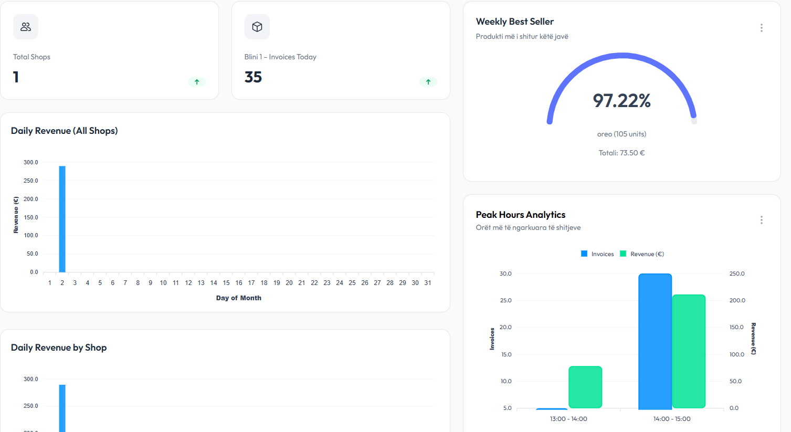
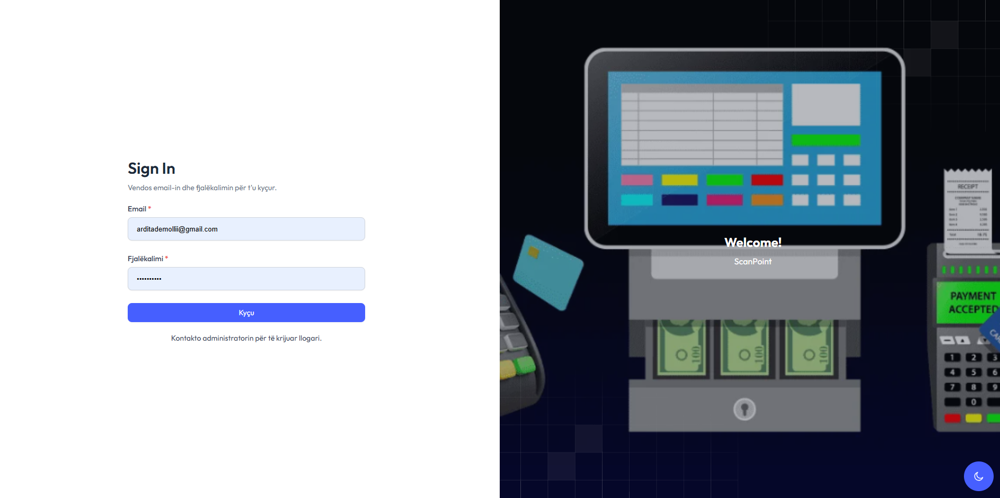
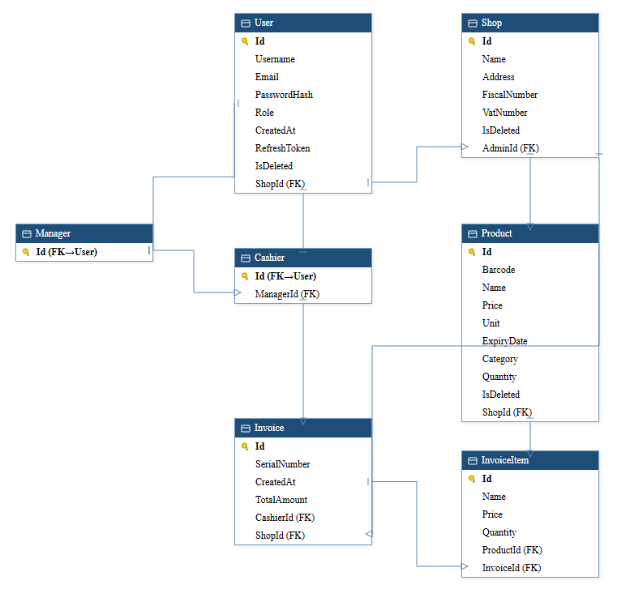

<div align="center">

# ScanPoint

**Multi-shop retail management, reinvented for the counter.**

Point of sale, inventory, and revenue analytics — in one system, built to run across as many shops as you can open.

[](#)
[](#)
[](#)
[](#)
[](#license)

[Features](#features) · [Architecture](#architecture) · [Setup](#getting-started)

</div>

---

## The Problem

Small and mid-sized retail chains run on duct tape.

Every shop keeps its own spreadsheet. Stock counts live in someone's head until they don't. Cashiers get full database access because nobody built a role system. Fiscal numbers, VAT numbers, expiry dates — the stuff a tax audit actually asks for — get bolted on after the fact, if at all.

Off-the-shelf POS software either costs more than the business can justify, or assumes you have one register in one store. Neither works for an owner who's opening a second location.

## The Solution

**ScanPoint** is a multi-tenant POS and inventory platform built around one idea: a shop owner should see *everything*, and a cashier should see *exactly enough*.

Every shop is isolated at the data layer. Every account is provisioned by an admin, not self-registered. Every product carries a barcode, a category, and an expiry date from day one. Every invoice is tied to the cashier who issued it and the shop it belongs to — because when the numbers don't add up, you need to know where to look.

It's the kind of system you'd expect from a team, built as a solo full-stack engineering project — schema design, API, auth, and UI, end to end.

---

## Features

### 📊 Live business intelligence, not just a data table
The dashboard answers the questions an owner actually asks first thing in the morning: how many shops are active, how many invoices came in today, what's selling, and when. Best-seller tracking and peak-hour analytics turn raw invoice rows into decisions.



### 🔐 Role-based access, enforced at the schema level
`Admin → Manager → Cashier` isn't a UI convention — it's baked into the database via table-per-type inheritance. A `Cashier` *is* a `User`, but only ever sees their assigned shop's register. A `Manager` oversees cashiers. Nobody can accidentally see, or touch, more than their role allows.

### 🧾 Invoicing built for real tax compliance
Shops carry `FiscalNumber` and `VatNumber` from creation — not an afterthought bolted on before an audit. Every `Invoice` links a `SerialNumber`, a `Cashier`, and a `Shop`, with itemized `InvoiceItem` rows tracing every sale back to a specific `Product`.

### 📦 Inventory that knows what it's selling
Products carry barcodes, categories, units, live quantities, and expiry dates — the fields an actual stockroom needs, not just a name and a price.

### 🕵️ Nothing is ever really deleted
Soft-delete (`IsDeleted`) is applied consistently across `User`, `Shop`, and `Product`. Data gets hidden from the UI, never destroyed — because in retail, "undo" is a business requirement, not a nice-to-have.

### 🌗 Localized, and built for the person behind the register
The interface ships in Albanian, with a dark mode toggle for late closing shifts. Account creation is admin-gated — no public sign-up, no rogue accounts.



---

## Architecture

ScanPoint follows a clean separation between a stateless **.NET Web API** and a **React + TypeScript** client, talking over a versioned REST contract secured with JWT access tokens and rotating refresh tokens.

```
Client (React + TypeScript)
        │  REST + JWT
        ▼
API (.NET, Controllers → Services → Repositories)
        │  EF Core
        ▼
SQL Server
```

**Why this shape:** the layered backend keeps controllers thin, business rules in services, and data access behind repositories — so the schema (below) can evolve without rewriting the API surface on top of it.

### Data model

Multi-tenancy runs through `ShopId` on every operational table. User roles are modeled with inheritance rather than a single bloated `Users` table with nullable role-specific columns — the schema tells you what a `Manager` *is*, not just what it's allowed to do.



| Entity | Responsibility |
|---|---|
| `User` | Base identity: credentials, role, refresh token, soft-delete flag |
| `Shop` | Tenant boundary: fiscal identity, VAT number, admin owner |
| `Manager` / `Cashier` | Role-specific extensions of `User`, with a `Manager → Cashier` hierarchy |
| `Product` | Inventory unit: barcode, price, quantity, category, expiry |
| `Invoice` / `InvoiceItem` | Transaction record and its line items, scoped to shop and cashier |


## Tech Stack

| Layer | Technology |
|---|---|
| Frontend | React, TypeScript |
| Backend | .NET (ASP.NET Core Web API) |
| Database | Microsoft SQL Server, EF Core |
| Auth | JWT access tokens + refresh token rotation |
| Architecture | Layered (Controller → Service → Repository), Repository Pattern, DTOs |

---

## Getting Started

```bash
# Clone
git clone https://github.com/arditademollii/ScanPoint.git
cd ScanPoint

# Backend
cd api
dotnet restore
dotnet ef database update
dotnet run

# Frontend
cd ../client
npm install
npm run dev
```

Configure your connection string and JWT secret in `appsettings.Development.json` before running migrations.

The first account must be provisioned directly in the database or via a seed script — ScanPoint has no public sign-up by design.


</div>
